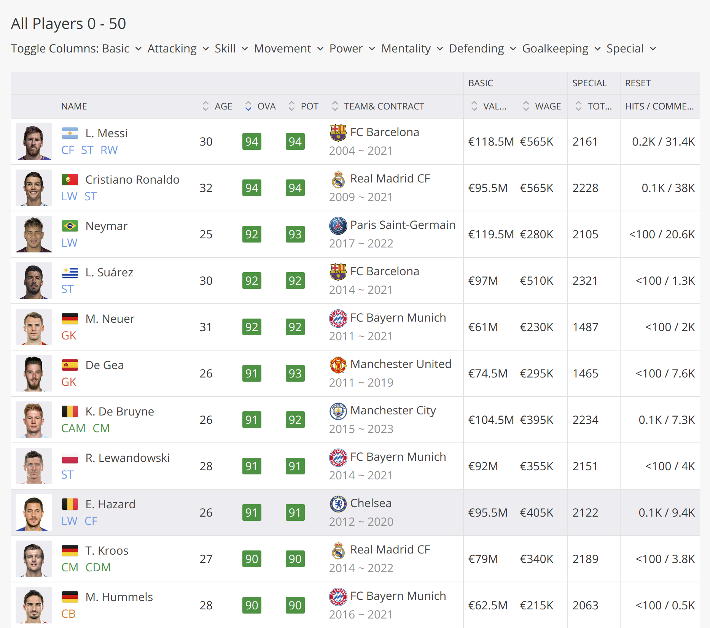
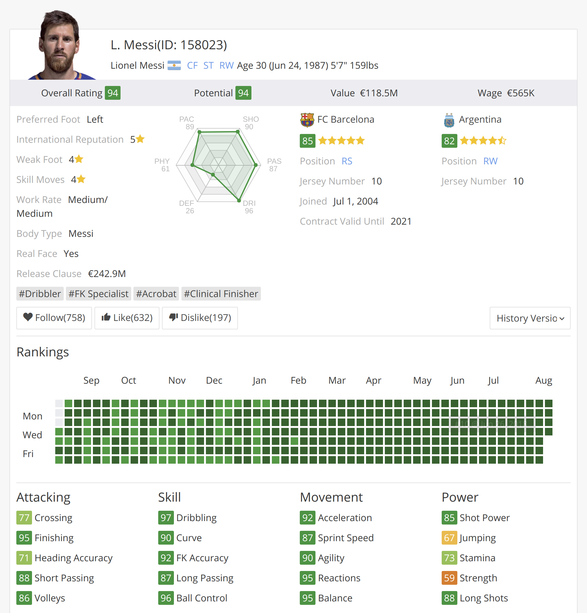
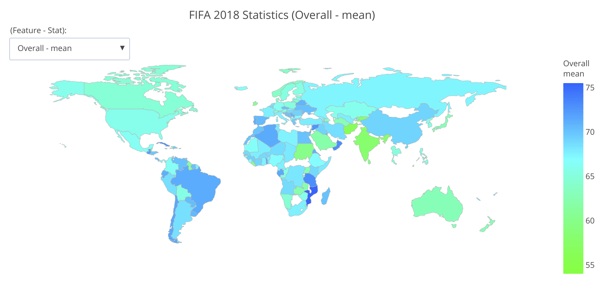
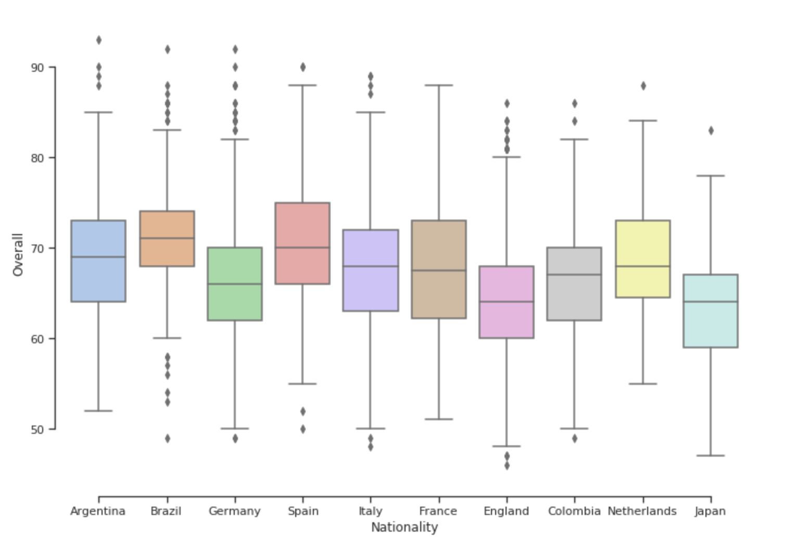
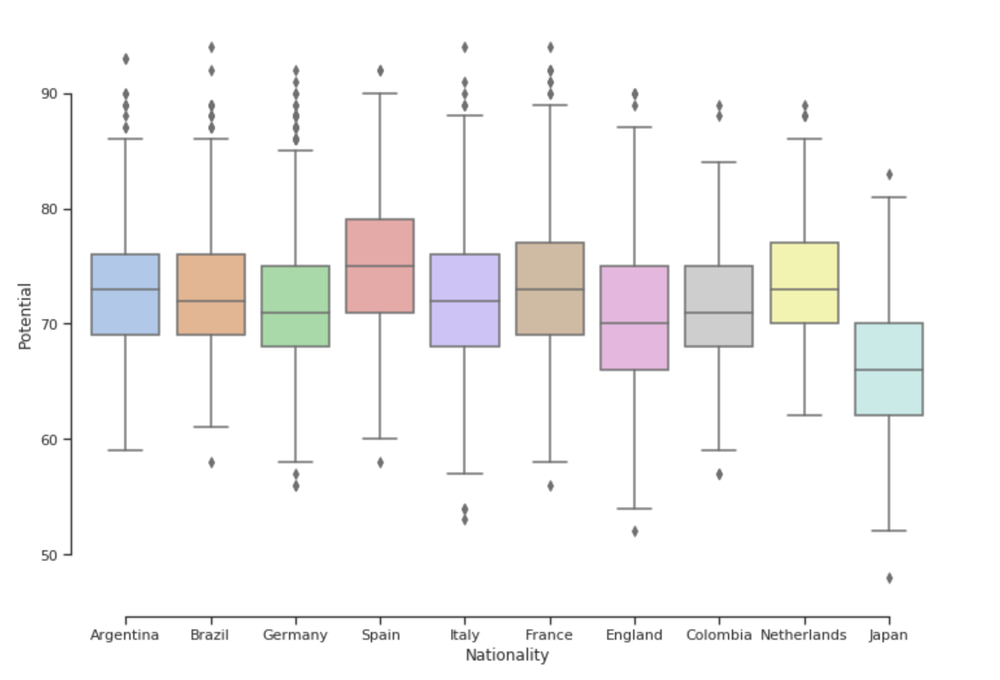
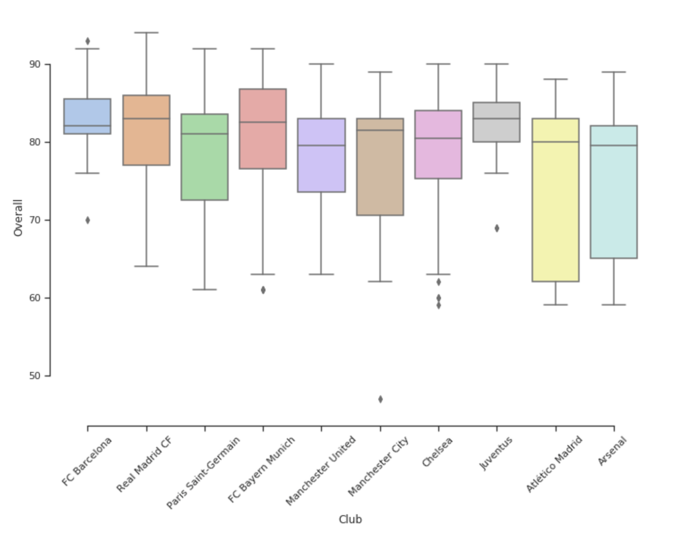
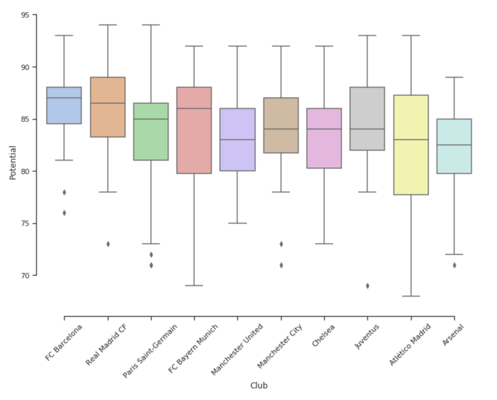
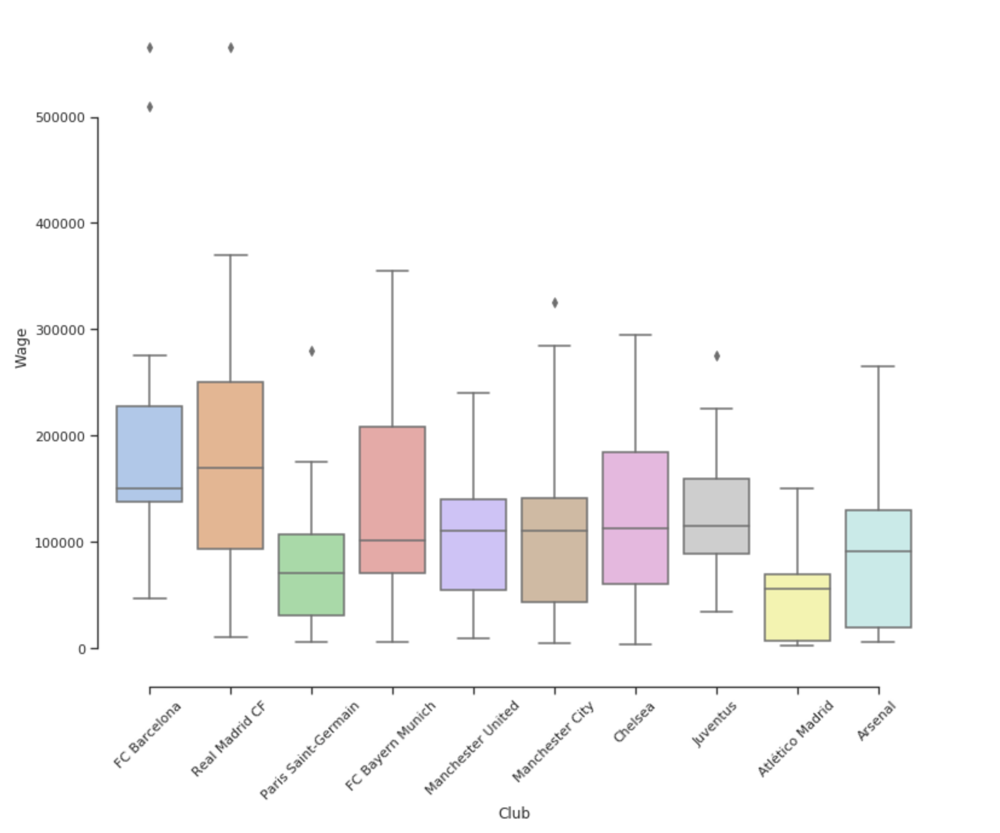
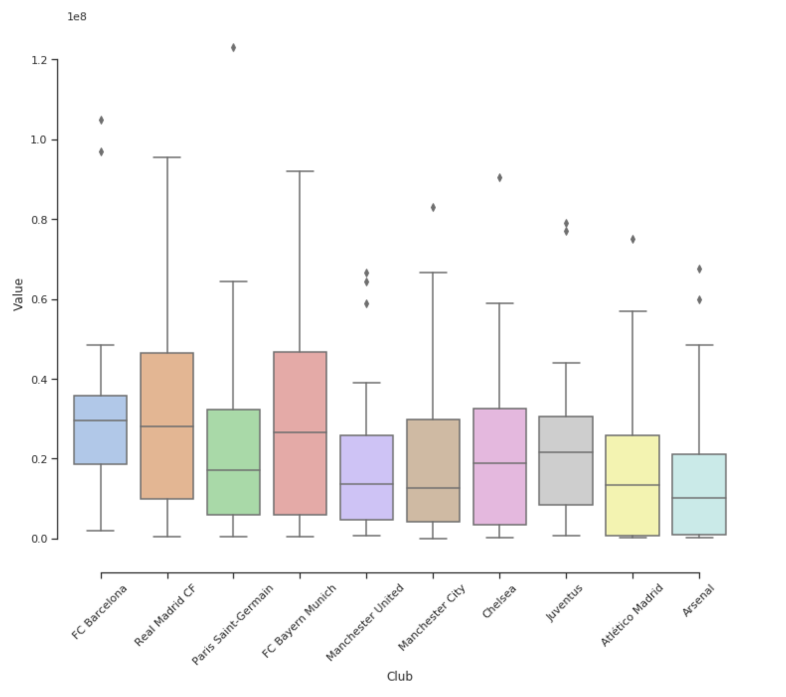
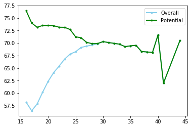

## The Data

### Data Description
<p align='justify'>The data was scrapped from the sofifa website using a python crawling script. The website contains the data from the EA Sports' game FIFA and gets updated regularly with the release of new versions of the game. data developed by Electronic Arts for the latest edition of their FIFA game franchise. Through several research projects done on soccer analytics, it has been established in the field of academia that the use of data from the FIFA franchise has several merits that traditional datasets based on historical data do not offer. Since 1995 the FIFA Soccer games provide an extensive and coherent scout of players worldwide.</p>

<div style="page-break-after: always;"></div>

<p align='justify'>For each attribute, we have an integer from 0 to 100 that measures how good a player is at that attribute. Examples of attributes are: dribbling, aggression, vision, marking and ball control. Observe that it seems to be unfeasible to accurately characterize players in these attributes automatically. Thus, all of those are gathered and curated by the company whose job is to bring the gameplay closer to reality as possible, hence preserving coherence and representativeness across the dataset.</p>

<p align='justify'>The FIFA 18 dataset that has been used for this analysis provides statistics of about 16000 players on over 70 different attributes. These attributes are optimal indicators to determine the performance of a player at a particular playing position.</p>

### Data Collection
<p align='justify'>After extensively studying the structure of the website, the crawler was designed to scrape the website in two steps. The first step was to scrape the main page of the webpage which contains basic player information in a table. Apart from extracting the basic player info the crawler extracted the url of the player's detailed statistics page.</p>

<p align='justify'>The table on the webpage had entries for 80 players on each page and the url of the page took offset for player id as a query parameter. The scrapper managed to algorithmically generate the urls of all the pages on website by manipulating the offset query in the url and iteratively visited all the pages to extract the details.</p>



<br>

<p align='justify'>The next step was to use the collected urls for individual players to scrape data from their details page. This page contained skill statistics, team affiliations and performance statistics for the player.</p>

<br>



<br>

### Content

<p align='justify'>The scrapped dataset has the following properties: </p>

* Every player featuring in FIFA 18
* 70+ attributes
* Player and Flag Images
* Playing Position Data
* Attributes based on actual data of the latest EA's FIFA 18 game
* Attributes include on all player style statistics like Dribbling, Aggression, GK Skills etc.
* Player personal data like Nationality, Photo, Club, Age, Wage, Salary etc.

```python
data.columns
Index(['ID', 'Photo', 'Name', 'Age', 'Nationality', 'Flag', 'Overall',
       'Potential', 'Club', 'Club Logo', 'Value', 'Wage', 'Special',
       'Acceleration', 'Aggression', 'Agility', 'Balance', 'Ball control',
       'Composure', 'Crossing', 'Curve', 'Dribbling', 'Finishing',
       'Free kick accuracy', 'GK diving', 'GK handling', 'GK kicking',
       'GK positioning', 'GK reflexes', 'Heading accuracy', 'Interceptions',
       'Jumping', 'Long passing', 'Long shots', 'Marking', 'Penalties',
       'Positioning', 'Reactions', 'Short passing', 'Shot power',
       'Sliding tackle', 'Sprint speed', 'Stamina', 'Standing tackle',
       'Strength', 'Vision', 'Volleys', 'CAM', 'CB', 'CDM', 'CF', 'CM', 'LAM',
       'LB', 'LCB', 'LCM', 'LDM', 'LF', 'LM', 'LS', 'LW', 'LWB',
       'Preferred Positions', 'RAM', 'RB', 'RCB', 'RCM', 'RDM', 'RF', 'RM',
       'RS', 'RW', 'RWB', 'ST'],
      dtype='object')
```

### Data Cleaning and Manipulation

<p align='justify'>As the data was scrapped from a website it had several inconsistencies and properties that made it unfit for appropriate exploratory analysis. In order to prepare the data, the following steps were performed: </p>

* The Wage and Value of all the players were in form of strings with the symbol of the currency in front of the values - `€190K`. These had to converted to numeric values.
* The preferred positions of all the players was available as a space separated string (`ST LW`) which was converted to a list for easier retrieval.
* A new attribute `FieldPosition` was created by mapping the preferred positions of all the players with their respective roles in the team, like attack, midfielder, defence or goalkeeper.
* Using the nationality of the players, a new attribute was created that contained the continent the player belonged to.

## Exploratory Data Analysis

<p align='justify'>After preparing the dataset for analysis, explorations were made on a macro level like continent and player nationality level analysis as well as on player level. Through the process attempts were made to derive interesting correlations and trends by the use of visualizations.</p>

<br><br>

### Geographic distribution of players
<p align='justify'>---Insert text here----</p>


<p align='justify'>---Insert text here---</p>

### Nationality wise analysis

<p align='justify'>This section explores aggregate statistics of players hailing from all major football playing nations. Country wise mean, maximum and minimum values were identified for all the numeric attributes and plotted on an interactive world map.</p>




<p align='justify'>The above plot demonstrates that South American, African and European players are generally rated higher than their counterparts from Asia, Australia or North America. While the nationwide average rating for USA stands at 65.81 and 58.06 for India it is about 71.24 for Brazil and 69.11 for China.</p>

### Countries with the best aggregate player ratings

<p align='justify'>To explore which teams have the potential to surpass the current best, the following analysis was done. The top 10 countries by number of players were chosen and the overall and potential of their players were depicted as box plots.</p>


Overall Rating             |  Potential Rating
:-------------------------:|:-------------------------:
  | 


<p align='justify'>The mean overall is seen to be highest for Brazil followed by Spain, Argentina, Netherlands and France. However, in terms of potential, Spain seems to have overtaken Brazil, followed by Netherlands and France.
This gives an indication about which teams are likely to perform better in the coming few years. Further ways in which this analysis can be improved is by plotting box plots against the highly and mildly correlated attributes that we saw above to reveal which are the attributes a country’s players are focusing on and make changes in their strategy if deemed fit.</p>

### Clubs with the best aggregate player ratings

<p align='justify'>The aggregate overall and potential rating were compared among and between the top 10 football clubs. These clubs were identified to have the best overall rating aggregate.</p>

Club          |  Average Rating
:-------------------------:|:-------------------------:
	Real Madrid CF | 83.0
	Juventus |	83.0
	FC Bayern Munich |	82.5
	FC Barcelona |	82.0
	Manchester City |	81.5
	Paris Saint-Germain |	81.0
	Chelsea |	80.5
	Atlético Madrid|	80.0
	Manchester United|	79.5
	Arsenal |	79.5

<p align='justify'>The variation of overall rating and potential rating was then demonstrated for these clubs using boxplots. This gives an indication about which teams are likely to perform better in the coming few years. Further ways in which this analysis can be improved is by plotting box plots against the highly and mildly correlated attributes that we saw above to reveal which are the attributes a country’s players are focusing on and make changes in their strategy if deemed fit.</p>

Overall Rating             |  Potential Rating
:-------------------------:|:-------------------------:
  | 

<p align='justify'>The mean overall is seen to be highest for Real Madrid followed by Juventus, FC Bayern Munich, FC Barcelona and Manchester City. However, in terms of potential, FC Barcelona seems to have overtaken Real Madrid, indicating a presence of a lot of young talent at the club.</p>

### Player earnings at top clubs

<p align='justify'>A quick way to understand which clubs command the highest salaries is to plot the wages as a box-plot. This gives all the important statistical metrics as well as the spread about the mean.To do this analysis, the top 10 clubs by median overall rating were chosen and their wages depicted as box plots.</p>

By Wage             |  By Player Value
:-------------------------:|:-------------------------:
  | 

<p align='justify'>Real Madrid is seen to have the highest wage in terms of mean wage, followed by FC Barcelona and Manchester United and Manchester City. A real world application of this analysis can be used by players to decide which club they should strive for if they want a wage hike. Also in terms of most valuable players, Real Madrid and FC Bayern Munich seem to lead the pack. </p>

### Player rating variation with age

<p align='justify'>All players have been rated according to their overall performance as well as their potential rating in the future. On basic visual analysis of data it was noticed that a few of the older players had already reached their potential rating. To further delve into this and find an age where overall met the potential, the data was grouped by age and at each age, the average overall and average potential were calculated. These values were plotted as a line graph against the age as the line graph would show a clear trend of changes in these ratings and also if the ratings met at a certain point. </p>

<p align='center'></p>

<p align='justify'>
As we can see from the above graph, we notice that overall and potential meet approximately at around age 29 and continue to match as the age goes up. Another interesting tend that was observed is that while overall increases as age increases and peaks between the years 29 to 33, the potential rating actually decreases as age progresses till it meets the potential and then plateaus. There are very few players above the age of 37 and have been ignored as outliers.
This analysis can be useful for while creating a squad as the age can be used as a factor in deciding whether a player should be retained or dropped. A way that this can be further enhanced is to find the trend of each player attribute across ages to determine the age at which each player attribute peaks.
</p>

### Analysis of Player Value over Age

<p align='justify'>Player value parameter in our data is the monetary figure which is a player should sell for in the current market based mainly on their performance, age and position. Here we try to analyse the mean player value over ages 18 to 36, for the top 1000 players ranked as per their overall potential. For this purpose we try to subset the data from original dataset to get players first in the age range and then select the top 1000 players from there. We have used a box chart as well a line chart here to display the data, with the Ages on the x-axis and the Average Player Value(in millions of Euros) on the y-axis. As per this chart, we can see that their seem to be two peaks for Player value – One right at age 18(20.4 M Euros) , and the other at age 25(20.8 M Euros). This seems to indicate that young players entering 18 years of age tend to be traded at high values across clubs due to their sheer potential. After 18,their appears to be a sharp drop at age 19. Average player value rises from age 19 onwards to peak at 25, following which there is gradual decline till age 32. Player value sharply falls after that, most likely due to the fact that older players in their mid-late 30s are considered to have spent their potential by then and have less resale value among clubs, in spite of the fact that they are more experienced. </p>

[Rating vs Age](ovrpotage.png)

<p align='justify'>
Next we have focused on the distribution of player value over the ages as opposed to previous plot of average values. For this purpose we have used violin plots, with box plot within. The violin plot is more informative than a simple box plot here because not only does it convey the distribution of the Player Value at each age (through Min,Q1,Median,Q3,Max) but it also shows the kernel density i.e. how common each Player Value point is by the width of its shape. The observations here are that most Player Values(between Q1 and Q3) across all ages have nearly the same kernel density(kernel datapoints are players); It’s the high performing players who are outliers and pulling up average values at each age. One departure however is again at the age 18, where from the shape of the violin we can make out that 18 year old players are most evenly distributed in the range 8-36 Million, therefore bringing up averages across all 18 year olds. Again goes to show how much youth is valued for it’s potential in football. Also from the distribution it is apparent that player valuation decreases post 32 for nearly all players apparent from  the violin density. From the density we can also make out that there are far fewer active older players as well as players aged 19-20 who are in the top 1000.
</p>
